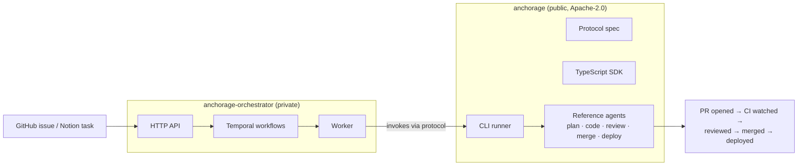
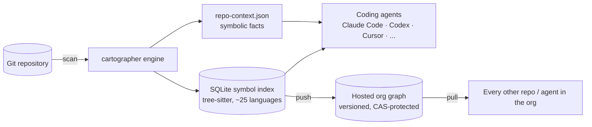
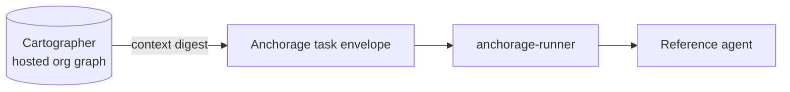

# AnchorageLabs

AnchorageLabs builds infrastructure for software automation: coding agents that
plan, write, review, and ship code, and the structural context those agents
need to do it without re-discovering a repository from scratch every time.

<picture>
  <source media="(prefers-color-scheme: dark)" srcset="anchoragedark.svg">
  <source media="(prefers-color-scheme: light)" srcset="anchoragelight.svg">
  
</picture>

## What we build

Two products, designed to be used together but useful independently.

### Anchorage — protocol, agents, and orchestration

An open-core stack for end-to-end software automation: a wire protocol for
task envelopes, a TypeScript SDK, a reference CLI runner, and reference
agents (issue reading, planning, coding, review, merge, deploy) — all
Apache-2.0. The proprietary orchestrator ("the mainframe") sits above that
protocol, sequencing agents into durable Temporal workflows: issue → code,
issue → merge, issue → deploy, and equivalents starting from a Notion task.

Anyone can build an agent against the public protocol; the orchestrator is
what runs it durably in production.

### Cartographer — symbolic repo context for agents

Cartographer scans a repository and persists a machine-queryable context
artifact — stack, commands, entry points, architecture, env vars — plus a
tree-sitter-backed symbol index (definitions, references, imports, routes,
tests) in a local SQLite cache. Agents query `cmd:test` or run
`cartographer impact <symbol>` instead of `grep`/`cat package.json`, with
zero LLM tokens and no network calls. The index can be pushed to a hosted
org graph so every agent working across a company's repos — Claude Code,
Codex, Cursor, or the Anchorage runtime itself — queries the same fresh
structure.

### How they fit together

Cartographer's compact context digest is injected directly into Anchorage
task envelopes, so an orchestrated agent starts a task already knowing the
repo's shape instead of spending its first turns discovering it.

## Principles

- Build useful systems, not demos.
- Prefer clear protocols and explicit contracts.
- Never invent facts: explicit declarations beat inference beat heuristics;
  undetectable means "unknown," not a guess.
- Keep architecture understandable and automation auditable.
- Design for reliability and determinism from the beginning.
- Use simple tools until complexity is justified.

## How we work

- GitHub-centered development, with agent-driven contribution docs
  (`AGENTS.md`) in every repo.
- Structured planning before implementation; every substantive PR cites the
  issue or ADR that motivates it.
- Clear boundary between open-core (protocol, SDK, reference agents,
  Cartographer engine) and proprietary infrastructure (the orchestrator,
  the hosted graph).
- Infrastructure as code where infrastructure exists.

## Founders

AnchorageLabs is a personal venture by Valentin Torassa and Sol Soletti.

## Contact

For now, AnchorageLabs is founder-led and privately operated.
